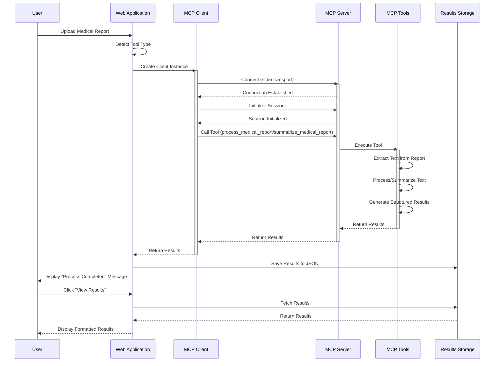
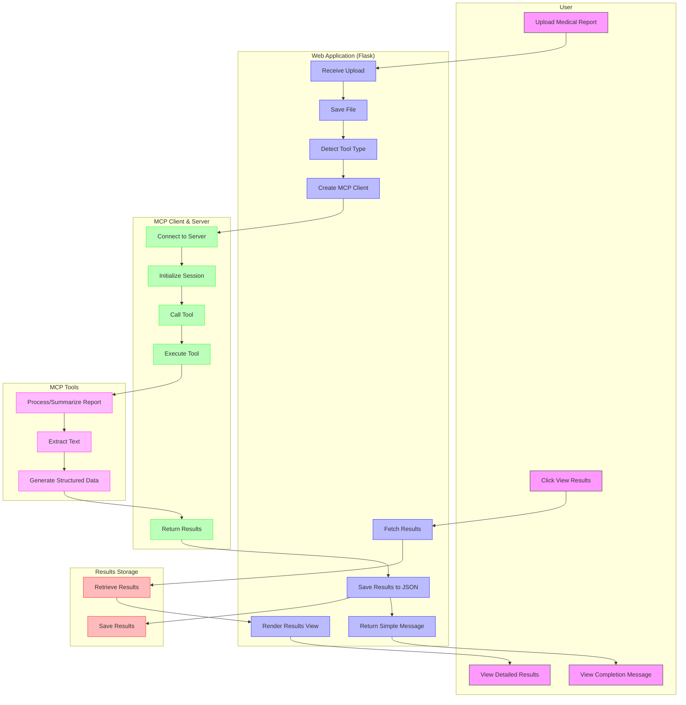
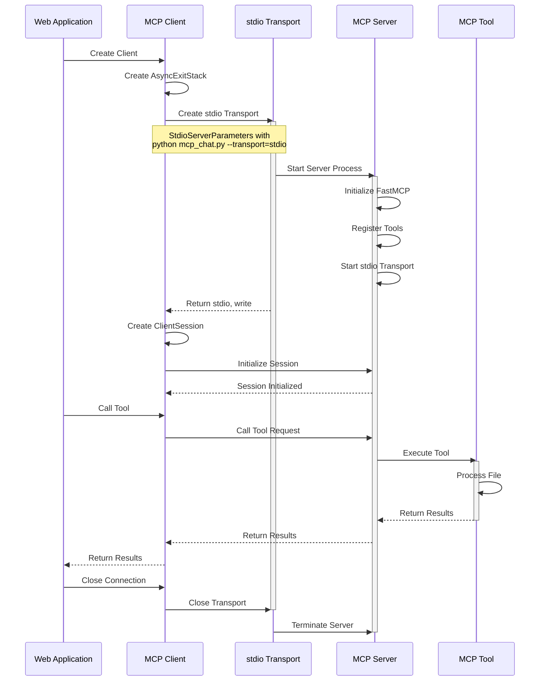

# MCP Flow and Swimlane Diagrams

This document contains Mermaid diagrams that visualize the flow and architecture of the Medical Report Processing application with MCP.

## System Architecture Flow Diagram

```mermaid
flowchart LR
    User([User]):::userClass
    WebApp[Web Application\n(Flask)]:::webClass
    MCPClient[MCP Client]:::mcpClass
    MCPServer[MCP Server]:::mcpClass
    Tools[MCP Tools]:::mcpClass
    Storage[(Results Storage)]:::storageClass
    
    User -- 1. Upload Medical Report --> WebApp
    WebApp -- 2. Detect Tool --> WebApp
    WebApp -- 3. Connect & Call Tool --> MCPClient
    MCPClient -- 4. Initialize Session --> MCPServer
    MCPClient -- 5. Call Tool --> MCPServer
    MCPServer -- 6. Execute --> Tools
    Tools -- 7. Return Results --> MCPServer
    MCPServer -- 8. Return Results --> MCPClient
    MCPClient -- 9. Return Results --> WebApp
    WebApp -- 10. Save Results --> Storage
    WebApp -- 11. Display "Process Completed" --> User
    User -- 12. Click "View Results" --> WebApp
    WebApp -- 13. Fetch Results --> Storage
    WebApp -- 14. Display Formatted Results --> User
    
    classDef userClass fill:#f9f,stroke:#333,stroke-width:2px;
    classDef webClass fill:#bbf,stroke:#33f,stroke-width:2px;
    classDef mcpClass fill:#bfb,stroke:#3f3,stroke-width:2px;
    classDef storageClass fill:#fbb,stroke:#f33,stroke-width:2px;
```

## MCP Communication Flow Diagram



## MCP Swimlane Diagram



## MCP Tool Registration and Execution Flow


## MCP Client-Server Communication



## MCP Tool Detection and Selection

```mermaid
flowchart TD
    Start(["Start"]):::start --> HasFile{"Has File?"}:::decision
    
    HasFile -->|"Yes, No Message"| DefaultProcess["Use process_medical_report"]:::action
    HasFile -->|"Yes, With Message"| CheckKeywords["Check Message Keywords"]:::process
    HasFile -->|"No"| CheckKeywords
    
    CheckKeywords --> CountSummarize["Count Summarize Keywords"]:::process
    CountSummarize --> CountProcess["Count Process Keywords"]:::process
    
    CountProcess --> CompareKeywords{"Compare Keyword Counts"}:::decision
    
    CompareKeywords -->|"Summarize > Process"| UseSummarize["Use summarize_medical_report"]:::action
    CompareKeywords -->|"Process > 0 or Has File"| UseProcess["Use process_medical_report"]:::action
    CompareKeywords -->|"No Clear Match"| UseGeneral["Handle as General Question"]:::action
    
    DefaultProcess --> ReturnTool["Return Tool Name and Confidence"]:::action
    UseSummarize --> ReturnTool
    UseProcess --> ReturnTool
    UseGeneral --> ReturnTool
    
    ReturnTool --> End(["End"]):::end
    
    classDef start fill:#f9f,stroke:#333,stroke-width:1px;
    classDef end fill:#f9f,stroke:#333,stroke-width:1px;
    classDef decision fill:#bfb,stroke:#3f3,stroke-width:1px;
    classDef process fill:#bbf,stroke:#33f,stroke-width:1px;
    classDef action fill:#fbb,stroke:#f33,stroke-width:1px;
```
